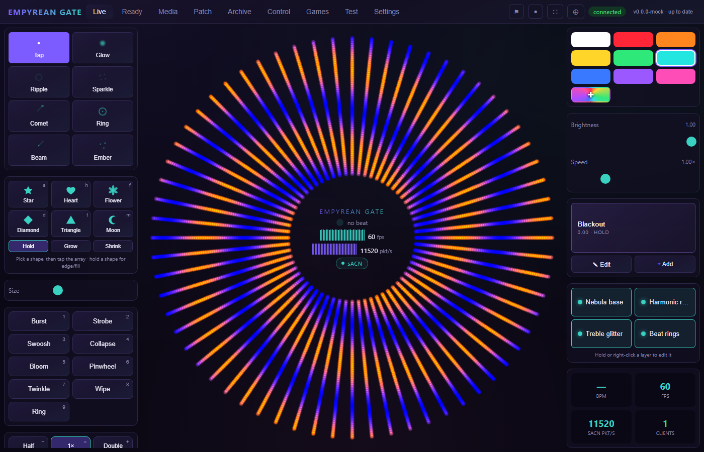
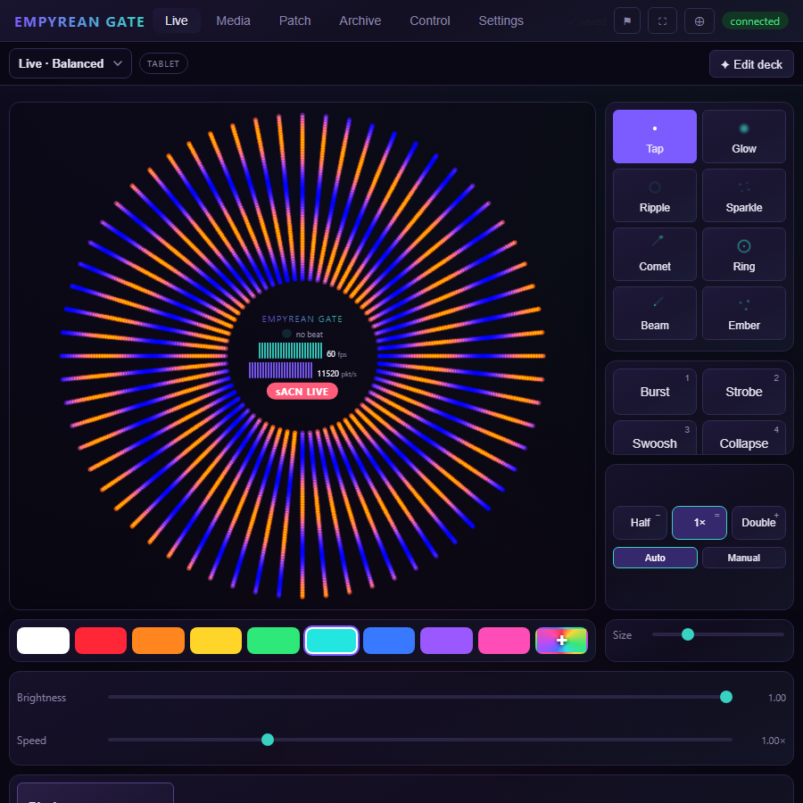
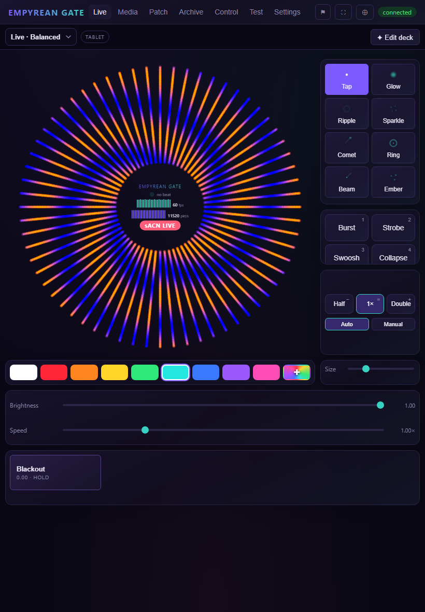
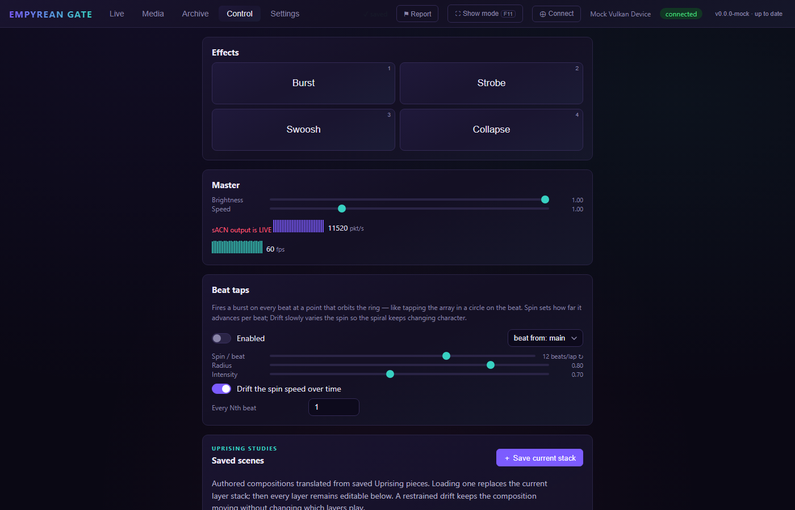
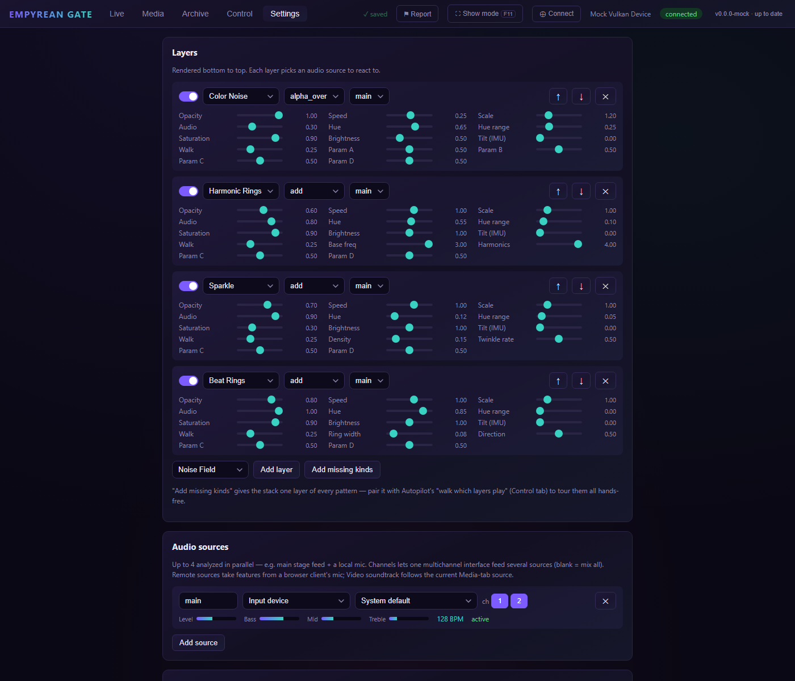
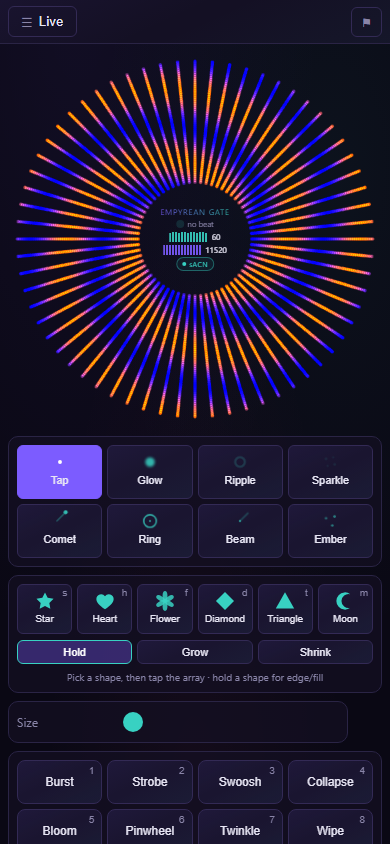
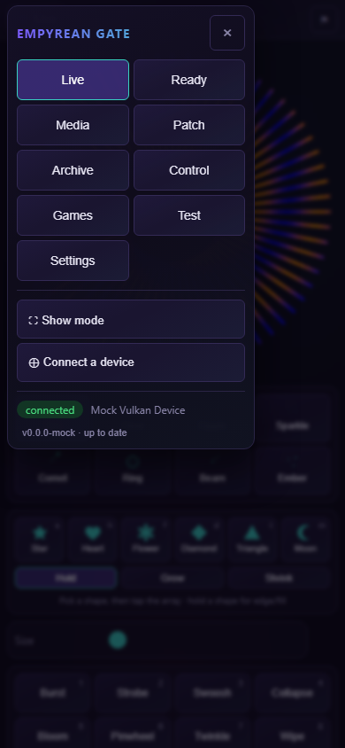

# Empyrean Gate

GPU pattern generator and sACN pixel driver for the **Empyrean Gate** — a radial array
of lights above a dance floor: 64 spokes of LED strip (378 px each, fed from the
outside) in a 50 ft diameter ring, driven by 16× Advatek PixLite Mk4-S controllers over
sACN (E1.31).

Every frame is computed from scratch on the GPU (wgpu locked to **Vulkan** — no
fallback renderers, just clear errors), read back, and scattered into prebuilt sACN
packets with zero steady-state allocations. Audio from the DJ (multiple parallel
sources) drives the patterns via beat tracking and band energies.

## Screenshots



| Squarish window — corner controls | Tablet / portrait | Control | Settings |
|---|---|---|---|
|  |  |  |  |

| Phone — array on top, controls below | Phone — the corner menu |
|---|---|
|  |  |

The Live surface adapts to the window: the array view stays as large as possible and
the controls flow into whatever space is left — side columns, top/bottom bars, or the
corners the circle never reaches. The empty ring center carries the title, beat, and
live meters. The columns reflow into more sub-columns as the leftover space grows, so
an ultrawide show display shows everything at once. Where the window genuinely has no
room — a squarish aux window, a portrait tablet — the secondary controls (master,
quick settings, layers, status) fold behind an **All controls** sheet rather than
taking size away from the array. The whole thing is chosen by CSS aspect-ratio media
queries, so it is correct at first paint with nothing to arrange or maintain.

**Show mode** (⛶ in the top bar, or F11) takes the native window fullscreen and hides
the app chrome so the array fills the display; Esc or the corner pill brings it back.
The state persists, so the app reopens the way it was closed — including across
self-updates.

**On a phone** the top bar is one row: a ☰ corner menu naming the current tab, and
Report. The tabs and every other top-bar action — show mode, connect a device, new
window, the connection state, the version chip — live inside that menu, which is a
row of chrome the array gets back and, more to the point, the only way those controls
are reachable at that width. Live is a scrolling column there: a drag on the array
draws (it swallows pan gestures), a drag anywhere else scrolls to the controls below.

## Architecture

- **Backend is the app.** Frame generation runs on a dedicated thread:
  GPU compute → readback (ping-pong staging, no stalls) → sACN + preview fan-out.
  Kill every UI and the lights keep running.
- **Every UI is a WebSocket client.** The backend serves the web UI (embedded in the
  binary) plus a JSON + binary protocol on port 9520. The Tauri desktop window, LAN
  browsers, and phones all speak the same protocol.
- **Remote inputs**: a phone on the LAN can contribute its microphone (features
  extracted client-side, same beat tracker as local sources) and its IMU orientation
  (steers layers/effects). See Settings → This device.
- **Layers**: noise fields (3D simplex / multidimensional color noise), harmonic radial
  waves, spirals, plasma, spoke chases, sparkles, beat rings, breathing envelopes,
  rainbows, wedges, interference, fire, meteors, warp — plus MilkDrop-style raw-audio
  layers: **Waveform** (the PCM bent into a circular oscilloscope) and **Spectrum**
  (spoke-per-bin circular analyzer), plus **Video** (live browser-decoded texture,
  radial/kaleidoscope mapping and color treatment) —
  stacked with blend modes, each bound to an audio source. **Hold or right-click a
  layer** anywhere it is listed — the Live cluster, the Control faders — and its
  parameters open in a popover anchored to it: mix, motion, colour, audio, and
  whatever the layer kind's own four params are actually called ("Arms", "Twist",
  "Sharpness" for a Spiral). The array stays lit and undimmed behind it, because
  the point is to watch what the slider does. Reordering and deleting stay in
  Settings, one button away.
- **Effects**: transients that fire over the whole stack. Eight of them *move* —
  burst / strobe / swoosh / collapse / bloom / pinwheel / twinkle / wipe — from the
  keyboard (1–8), a pad, or a remote client. Six are **shapes** — star / heart /
  flower / diamond / triangle / moon — figures drawn from exact signed-distance
  fields and *stamped where you tap*: pick one (pad, or `s h f d t m`), then every
  press on the array plants that figure there, at the Size slider's size, holding
  its size or growing or shrinking away over its life. On Control, which has no
  array to aim at, a shape pad plants one centre-array instead. A tap with no shape
  selected is still a burst, and a drag still draws with the current pen.
- **Seven UI tabs**, deep-linkable by hash: Live (stage monitor + drawing), Media
  (image/video intake), Patch (node-graph editor), Archive (recorded-show replay),
  Control (touch-sized effect pads + master/layer faders), Games, and Settings.
  In the desktop app, "New window" pops the current tab out into its own window.
  Old `/#view` and `/#draw` links redirect to Live.
- **Game mode (early)**: the Games tab turns the array into a continuous game
  world — first game is **Ecosystem**, a cyclic predator-prey cellular automaton
  whose spiral fronts advance on the beat and never converge. Starting/stopping
  a game is Gate-machine-only (and refused while a playlist runs); playing is
  open to every connected phone — pick a species, tap the array, and your blob
  joins a simulation that runs fine with zero players, so there is nothing to
  wait for and nothing to ruin by leaving. Effects and drawing are suppressed
  during a game unless the operator overlays them. A green GAME MODE banner
  sits on every device while a world is live. Design notes and the game roster:
  `plans/game-mode.md`.
- **Patches (early)**: a node-graph alternative to the layer stack — wire
  generators, transforms, blends, and inputs (audio features, beats, LFOs,
  envelopes, IMU) into a typed dataflow whose sink is the array. Graphs compile
  to a single WGSL dispatch; knob tweaks and scalar wires never recompile.
  Patches save as JSON files under the config dir and activate live (the layer
  stack renders when no patch is active); six built-in presets seed the palette.
  Editing works on the Gate machine only; remote clients get a read-only view.
  Slated to replace the layer stack once all pattern kinds are ported — see
  `plans/node-graph.md`.
- **Archived-show replay**: open individual Uprising `.eg.data` RGB recordings or
  index an entire `Uprising-Data` checkout. Playback streams one 64×378 frame at a
  time from disk, supports seeking, looping, and variable playback speed, and keeps
  recent filesystem references without copying the recordings. Archive is available
  in production desktop, headless web, and PWA builds.
- **Live drawing**: paint on the array from any client with Glow / Ripple / Sparkle
  pens (color swatches + size). Strokes stream as polar dabs over WS and render on the
  GPU with ~2 s trails; multiple people can draw at once.
- **PWA**: open the web UI on an iPad/phone, "Add to Home Screen", and it runs
  standalone fullscreen — a touch control surface for the floor. Manifest shortcuts
  jump straight to Draw or Control.
- **Video intake**: paste a public Instagram post/Reel URL, a direct MP4/WebM URL,
  or a publisher page with standard
  `og:video` / HTML video metadata, or choose a file on the iPad. The browser uses
  its native hardware decoder and sends a bounded 64–128 px RGBA texture at 10–24
  fps; the backend retains only the latest frame, so congestion drops frames instead
  of adding latency. A Video layer maps it across the radial array with zoom,
  kaleidoscope, contrast, rotation, color treatment, blend, audio, and autopilot
  controls. Its rhythm source can be the decoded video's own soundtrack or any
  configured live Gate input; soundtrack analysis sends only compact features and
  can stay silent on the control device. If current `yt-dlp` plus a supported
  JavaScript runtime is installed on the Gate machine, provider pages such as public
  YouTube and Instagram videos get an additional best-effort resolver.
  DRM/login-gated sources remain unsupported.
- **Autopilot**: a slow mean-reverting random walk drifts layer parameters around
  wherever the sliders are set (per-layer "Walk" amount = wander radius), so an
  unattended show evolves for hours without repeating. Parameters the shaders
  quantize (spiral arm count, wedge count, direction flips) step deliberately
  rather than dithering across the boundary, and parameters that set a *rate* are
  integrated rather than multiplied into the elapsed phase, so a drifting speed
  stays a speed instead of jumping the pattern.
- **Runs for days**: layer phase accumulates in f64 and is wrapped, split or
  reset before it reaches the resolution limit of the f32 the GPU is handed —
  motion stays smooth on an installation nobody restarts. The one cure that
  is visible (zeroing the clock outright, for the noise-driven layers) is
  scheduled for a configurable hour of the day, `render.phase_reset_at`,
  defaulting to local noon when daylight has the array washed out anyway.
- **Set-and-forget shows**: saved playlists embed complete scene snapshots with a
  dwell time and smooth crossfade per cue. The backend advances them without an
  open browser, loops indefinitely when requested, persists the active cue across
  restarts, and exposes skip/hold controls plus a live countdown. The built-in
  all-night journey rotates through nine restrained compositions instead of
  leaving one look on the installation for hours.
- **Audio loopback**: pick a system *output* device as a source (WASAPI loopback) —
  music played on the show machine drives the beat with no cabling.
- **External lighting clock**: timing and audio energy are separate. By default each
  layer follows its selected audio detector, preserving the original behavior. A
  MIDI Timing Clock input can instead lock every layer to one DJ/mixer/bridge clock
  while level, bands, waveform, and spectrum still come from each layer's selected
  audio source. MIDI Start/Continue/Stop and Song Position are understood; input
  hot-plug, a ±250 ms visual latency offset, and an optional audio fallback are
  built in. The selected port is exact and is never silently substituted. Pioneer/
  AlphaTheta decks can also drive the clock directly over PRO DJ LINK: Gate is a
  passive UDP listener (never a virtual deck and never a sync-command sender),
  follows the reported tempo master or an explicitly selected player, and retains
  audio fallback through a deck/network outage.
- **Audio hardware can come and go.** A missing or unplugged device never crashes or
  degrades the show: the source goes quiet (visuals decay calmly), reports "waiting
  for device", and is retried every 2 s until *that* device returns — a selected
  device is never silently substituted. The one automatic change: sources set to
  "system default" follow the OS default device when Windows changes it. Hot-plugged
  devices appear in the pickers within a few seconds.
- **Connect QR + client management**: ⊕ Connect in the top bar shows a QR (per
  interface) that joins a phone/iPad straight to the web UI. Devices get persistent
  ids and friendly names; Settings → Clients lets you rename, revoke (kicks live,
  blocks rejoin), and optionally require the join token so only QR-scanned devices
  can connect (rotate the token to lock everyone new out).
- **Show-machine hardening**: the backend blocks system sleep while running (and
  display sleep while output is enabled — display sleep can take HDMI/DP
  display-audio loopback sources with it); config saves are crash-safe (temp +
  fsync + `.bak` fallback, protecting the persistent sACN CID from a power cut
  mid-save); a one-click banner authorizes a port-scoped Windows Firewall rule
  and pins Windows Update restarts to 9am–3pm, away from show hours (one UAC
  prompt ever — survives self-update binary swaps); and Settings →
  Updates has a "Launch at login" toggle that re-registers itself across updates,
  so a venue power cycle brings the show back without a keyboard.
- **Seamless takeover**: start a new backend while one is running and it warms its
  GPU first, asks the old instance to stop and hand over its running state (config,
  layer animation phases, and the sACN sequence number), then continues the output —
  the structure sees a sub-second hold, no blackout, and patterns don't jump.
  Continuing the sequence numbering matters because the CID is shared: a successor
  restarting at zero would land in the window receivers discard as out-of-order and
  freeze the rig on its last look. Deploying a new build mid-show is just "start the
  new binary".
- **sACN**: pick the egress interface explicitly (multi-homed machines otherwise send
  multicast out the default route — invisible on the lighting NIC), sync sACN to
  render fps or fix a rate, and optionally enable E1.31 universe synchronization
  (PixLite Mk4 latches all universes per sync packet, tear-free). Live packets/s in
  the status HUD tells you it's actually transmitting.
  Multicast and controller unicast are exclusive destination modes, so a configured
  receiver never gets duplicate sequence-identical packets.
- **A well-behaved sACN source.** The CID (source identity) is generated once and
  persisted, as the spec requires — so restarts and handovers look like the *same*
  source instead of a second one fighting the first in every receiver's merge for
  2.5 s. Streams are closed with E1.31 termination packets when output is switched
  off or the app exits, rather than leaving the rig holding its last frame until the
  receivers time out. The universe list is advertised on the discovery universe every
  10 s, so the source shows up in sACNView and controller UIs. Source name is
  configurable.

```
src/                React UI (preview + settings), WebGL2 preview, sensors
src-tauri/src/
  engine/           wgpu Vulkan engine + WGSL layer shader (hot-reloads in dev)
  audio/            cpal capture (per-source channel select) + FFT features + beat tracker
  rhythm.rs         external musical clocks (MIDI Clock first; deck/link adapters next)
  sacn.rs           allocation-free E1.31 sender (prebuilt per-universe packets)
  server.rs         axum HTTP + WS (serves UI, speaks the protocol)
  media.rs          guarded URL resolver + ranged same-origin media proxy
  config.rs         geometry / output / audio / layers, persisted JSON
```

## Development

Requirements: [Rust](https://rustup.rs), [Bun](https://bun.sh), a Vulkan-capable GPU +
driver. On macOS, install the Homebrew `vulkan-loader` and `molten-vk` packages; the
development binary discovers them automatically. A current
[`yt-dlp`](https://github.com/yt-dlp/yt-dlp) installation with a
supported external JavaScript runtime (Node works) is optional for resolving provider
pages; direct media URLs, metadata pages, and local device files do not need it.

```sh
bun install
bun tauri dev          # desktop app w/ vite dev server (hot reload, shader hot-reload)
```

Useful during pattern development:

- Edit `src-tauri/src/engine/shaders/gate.wgsl` while the app runs — the pipeline
  rebuilds on save.
- `cargo run --bin engine-smoke` (in `src-tauri/`) — quick headless correctness +
  timing check, no window.
- `cargo run --release --bin engine-smoke -- --suite --warmup 120 --frames 600`
  — repeatable GPU regression suite at the 24,192-pixel installation size plus
  a 70k heavy-load headroom case. Add
  `--json` for a versioned machine-readable report, or use `--pixels`, `--layers`,
  `--effects`, and `--dabs` to define one workload. Reports mean, p50/p95/p99/max,
  standard deviation, throughput, and missed frames against `--fps-budget`.
- `cargo run -- --headless` — full backend without the desktop window; open
  `http://localhost:9520` (or from a phone on the LAN).
- `bun run demo:uprising` — optional convenience: use authenticated GitHub access to
  fetch the small **Warm Windstorm** clip referenced by the saved 2024 show state. It
  lands in the shared per-user cache at
  `${XDG_DATA_HOME:-~/.local/share}/empyrean-gate/uprising/`, so every Git worktree sees
  the same archive. While Vite is running, that cache appears automatically in the
  production-grade **Archive** tab; production builds can always open files or index
  an `Uprising-Data` folder directly. Override the cache location with
  `EMPYREAN_UPRISING_DIR` when needed.
- `bun scripts/e2e-test.ts` — protocol smoke test against a running backend.
  It also sends a generated video texture and verifies live source status.
- `bun scripts/report-test.ts` — drives operator input against a running backend,
  requests a feedback report, and verifies the bundle end to end (timeline folding,
  frames.bin geometry, PNG contact sheet, path-traversal defense).
- `bun run test:layout` — the **layout gate** (see below).
- `bun run mock-backend` — serve the built UI with a deterministic fake backend
  (no GPU, no audio device) at http://127.0.0.1:9531. Handy for UI work.
- `bun run screenshots` — regenerate the screenshots in `docs/` from that same
  mock backend, so they never depend on this machine's config or GPU.

### The layout gate

CSS has no compile-time notion of "this doesn't fit", and on a touch surface the
failure is not cosmetic: one control a few pixels past the edge gives the whole app a
scrollbar, and then a drag scrolls the page instead of drawing on the array.

`bun run test:layout` builds the bundle, serves it through the mock backend, and walks
every tab at eight viewports (the 1080p show display, the 900px minimum window, a
square aux window, ultrawide, both iPad orientations, a phone). It fails when anything
extends past the viewport horizontally, when any box clips its own content, or when the
Live tab needs to scroll vertically (below the 700px breakpoint Live is a scrolling
column on purpose, so only the horizontal rule applies there). It also covers the two
overlays that only exist in a particular state: the phone's corner menu, and the sACN
contention banner — the mock backend takes a per-client status patch on
`POST /mock/status?client=<id>` so a state the real backend only reaches with another
console on the wire can still be laid out and checked. Anything deliberately parked
off-screen must declare `data-layout-exempt`. It runs on every push and on release tags.

`bun run test:behavior` covers what the gate structurally cannot see: a control can be
laid out perfectly and still be unusable. It asserts that the master sliders never
shrink below a width you could actually aim at, that brightness survives a drag to 0
**and back**, that the colour wheel's compass points are the right way round, that
quick-setting shortcuts migrate off the removed control decks, and that a phone can
actually reach every tab and every control on Live — the corner menu holds all of
them, the page scrolls, the array does not, and nothing on the surface is selectable.
These run on **both** Chromium and WebKit — the iPads are first-class clients, and
range-input rendering, pointer capture and canvas are not portable the way box
geometry is. The layout gate itself stays Chromium-only; that all of its cases pass
identically under WebKit was checked rather than assumed.

## Production build

```sh
bun install
bun tauri build --no-bundle
# → src-tauri/target/release/empyrean-gate(.exe)  — standalone, UI embedded
```

CI (GitHub Actions) builds Windows, Linux, and macOS binaries on every push. The same
binary runs the desktop app or `--headless` for show machines.

## Releases

Releases are cut by CI only — push a version tag and the Release workflow runs the
check suite, builds all targets, and publishes a GitHub Release with the standalone
binaries attached:

```sh
git tag v0.2.0 && git push origin v0.2.0
```

Grab binaries from https://github.com/cinderblock/empyrean-gate/releases.

### The WebView2 runtime (Windows)

The desktop window is drawn by Microsoft's Evergreen WebView2 runtime. Windows 11 ships
it; **Windows 10 often does not**, and a portable exe has no installer to bootstrap it.

On startup the app asks the WebView2 loader whether a runtime exists before it builds a
window. If none does, a dialog says so and offers to fetch Microsoft's ~2 MB
bootstrapper, which installs per-user and needs no administrator rights. Install it and
restart; the window comes back.

Whatever you answer, **the show is unaffected**. The backend is the app: sACN is already
sending and the web UI is already served by the time this check runs, so a missing
runtime costs you the desktop window and nothing else. The app carries on headless and
tells you to open `http://localhost:9520`. It never exits over this. (It also remembers
to stay headless across a self-update, since the next launch would hit the same wall.)

Before this check the failure was silent: the process started, the lights ran, and no
window ever appeared.

## Self-update

No installer needed — and that is a design decision, not an omission. An MSI would put
the binary somewhere that needs elevation, which would turn step 3 below into a UAC
prompt on every update, and would replace the one-frame live handover with a
kill-and-reinstall. On Linux the AppImage keeps the same property a bare binary has:
one file, which is what makes promotion a plain copy.

**In show mode**, where the top bar and its version chip are hidden, an available
update surfaces its own controls beside ⚑ Report — an install button and an
**Auto-update** checkbox — and only when there is actually an update to act on. So a
mid-set update is something you can see coming and decline, rather than something that
either happens to you or cannot be reached at all. Installing mid-show stays allowed on
purpose: the handover below is what makes it cost about a frame.

Because "not tonight" should not quietly mean "not ever", a client sitting in show mode
**leaves it once a day** at `update.leave_show_at` (default 09:00 local, blank to
disable) — an hour when the Gate is washed out by daylight anyway. Same reasoning as
`render.phase_reset_at`.

Updates are also **downloaded as soon as they are found**, even with auto-install off, so
taking one between sets is a tap rather than a tap and a 40 MB wait. That does mean a
release is pulled without being asked for; the staged copy sits beside the running binary
and is cleaned up at the next startup.

The app checks GitHub Releases (startup + every 6 h; toggle in
Settings → Updates) and shows a lit version chip in the top bar when a newer release
exists — click it (or use Settings) to update. Mid-show updates cost about one frame.
Auto-install is available but off by default.

What actually happens, since a standalone exe cannot overwrite itself while running:

1. The new binary downloads *beside* the running one as `empyrean-gate-v<version>.exe`
   and is launched.
2. The successor performs the two-phase handover — it warms its GPU pipeline, the old
   instance stops sACN and hands back config, layer phases and its sACN sequence
   number, then exits.
3. The successor **promotes** itself: it copies its own image over the path it was
   launched from (passed as `--promote-to`), so the shortcut, the Start menu entry
   and launch-at-login all point at the new version. Windows only releases the lock
   once the old process is gone, so the copy retries for a few seconds.
4. Superseded versioned siblings are deleted at the next startup.

Step 3 is what makes an update stick. Without it the launcher keeps the old binary
forever, and starting it finds the port busy and takes over — putting the *old*
version back on the rig. That cannot happen any more regardless: an instance refuses
to take the port from a **newer** one, and instead asks it to come forward
(`POST /focus`) and exits.

Binaries older than v0.5.3 don't pass `--promote-to`, so when the update is
started *by* one of them the successor works the launcher out for itself: it
notices it is running from a versioned download, finds the binary beside it that
the operator launches (any `*empyrean*` executable that isn't a versioned
download), and takes its place. So updating off an old version needs no manual
install either — click update and it heals itself. The one case that can't be
recognised is a launcher renamed to something without "empyrean" in it; that is
logged loudly.

Updates keep a single taskbar button: the app declares an explicit
AppUserModelID, without which Windows would give each new binary its own button
and break a pinned shortcut. A versioned binary sits beside the launcher between
an update and the next restart, then is cleaned up.

### When an update misbehaves

Release builds on Windows have no console, so logs go to a file next to the config:

```
%APPDATA%\EmpyreanGate\logs\empyrean-gate.log      # Windows
~/.config/EmpyreanGate/logs/empyrean-gate.log      # Linux
```

It records the version and path at startup, every takeover, and every update step —
including the promotion, which is the part that used to fail silently.

## Feedback reports

Hit **⚑ Report** (top bar, and still reachable in show mode) when the array does
something you don't like. The backend continuously keeps the last ~20 seconds of
everything that shapes a frame, so the button only has to ask what was wrong: it
freezes the chosen window — operator input, effective layer parameters (post-autopilot,
which is *not* what the config file says), audio features, and the rendered frames —
into a self-describing bundle on the Gate machine, with a PNG contact sheet of what it
actually looked like.

Bundles live in `<config dir>/EmpyreanGate/reports/<id>/` and are downloadable from any
client. Hand a whole folder to an agent to investigate. Format:
[`docs/report-bundle.md`](docs/report-bundle.md).

## Commissioning the rig — the Test tab

Shows cannot tell you whether the hardware is wired the way the config claims. The
**Test** tab can: it replaces every pixel with a deterministic pattern generated on
the backend, bypassing the engine, audio, effects, the scheduled show and the master
faders entirely. LED gamma is *not* bypassed, so a test exercises the real output
path; the tab shows both the requested byte and the post-gamma byte on the wire.

Patterns, and the question each answers: **solid colour** (colour order — send red,
and a GRB strip announces itself), **colour cycle** (the banner names what should be
lit right now), **Nth pixel** counted from the outer feed *or* the inner end (pixel
count, feed direction, null-pixel offsets), **ruler** (every 10th/50th/100th pixel
marked, so you can count the strip by eye), **universe marks** (first pixel of each
universe, checked against the controller's patch), **gradient** (feed direction on
every spoke at once), **spoke ID** (each spoke's number in binary), **chase**, and
**blackout** (a rig still lit is holding a last look, not following us). All of them
take a brightness, a blink rate, and a spoke selection: all, one spoke, one
controller's spokes, or auto-cycling.

**Detecting the controllers.** sACN is fire-and-forget — nothing acknowledges a
frame, so "output enabled" never tells you a PixLite is listening. The tab asks them
directly: a broadcast probe on UDP 49150 for Mk1/Mk2, the multicast "DiscProt"
exchange on 49151 for Mk3/Mk4, and a passive listen on the E1.31 discovery group for
*other* sACN sources. Replies are reconciled against the controller list in Settings
into found / missing / unexpected. Scanning is read-only and safe during a show.

**Detecting a rival source.** Separately from that one-shot scan, the backend listens
continuously for other E1.31 sources on the universes we transmit, and compares their
priority against ours. Three verdicts, because the operator's next move differs:
*higher* priority means the receiver discards our frames and the rig is following
something else; *equal* priority means E1.31 merges the two sources highest-takes-
precedence, so the rig does what **neither** of them asked for — the nastiest case,
and the one most easily mistaken for a bug in the show; *lower* is harmless for now
but is still someone else's console in our patch. Anything competing raises a banner
on every tab and in show mode, turns the ring's `sACN` chip red, and is listed with
its name, address, universes and packet rate under **Test → Other sACN sources**.
Sources flagged `Preview_Data` (a visualiser) are shown but never raise an alarm.

Two honest limits, which the UI states too: this hears **multicast only**, so a rival
that unicasts straight at the controllers is invisible to any passive listener on a
switched network; and multicast memberships are a bounded OS resource, so a large
patch is sampled rather than watched in full (the panel says how many universes).

Safety, because this drives the actual rig from any device on the LAN:

- Opening the tab does nothing, and changing parameters does nothing. Arming is a
  separate, deliberate action.
- Arming **never switches sACN output on or off**. If output is off the tab says so
  and offers to enable it; that stays your decision.
- Arming is **refused while the show scheduler is running a playlist**, naming it and
  offering to stop it first.
- Auto-exit after 30 minutes by default, enforced in the engine loop so it holds with
  no client connected.
- While armed, a red `TEST MODE` banner with a disarm button sits on every tab of
  every connected device, and survives show mode.

On Windows, discovery replies arrive unsolicited (they answer a broadcast/multicast),
so the firewall drops them until the **Authorize** button has been used — a scan finds
nothing on a network full of healthy controllers otherwise. Authorize now adds that
inbound UDP rule alongside the existing one.

`bun scripts/fake-pixlite.ts` stands up a fake Mk4 responder, so discovery can be
exercised without hardware.

## Live-show guards

The window's X sits a few pixels from the controls on a touch display, so while
sACN is actually transmitting it is refused and asks first; confirming still goes
through the normal shutdown, which sends E1.31 stream termination rather than
leaving the rig on its last look. Switching output off asks the same way. With
output off, neither asks.

## Touch screens

The Gate machine's display is multi-touch, and several fingers can draw or trigger
effects at once. The browser's own gestures are suppressed app-wide so they cannot
steal a stroke mid-gesture: press-and-hold context menus, pinch and keyboard zoom,
overscroll/back-swipe, double-tap zoom, long-press selection callouts, and — on Windows
— the OS-drawn contact visuals, which also caused the transparent array canvas to flash
its backing square under a tap.

## Safety notes

- **sACN output is OFF by default** — enable it in Settings → sACN output. 192
  universes at 60 fps is real traffic; unicast to controller IPs is preferred over
  multicast.
- Everything about the geometry (spoke count, pixels, radii, universe layout) is
  config, editable live in Settings and persisted to the user config dir. The
  defaults reproduce the patch the rig is already wired to: 378 px per spoke, 170
  px per universe (3 universes of data), and a **6-universe stride per spoke** —
  spoke 1 at 001.001–003.114, spoke 2 at 007.001, … spoke 64 ending at 381.114.
  The reserved universes between spokes are the unwired half of each PixLite's 8
  outputs, held for the planned doubling; nothing is transmitted on them.
- Remote media fetching accepts only HTTP(S), rejects credentials and local/private/
  reserved destinations, pins each connection to its validated DNS answers,
  bypasses system proxies, revalidates redirects, caps inspected HTML and live proxy
  sessions, and exposes streams through short-lived opaque URLs. This prevents the
  feature becoming an unauthenticated proxy into the show/control network.

## Not yet

- Bundled extraction for changing provider sites; optional `yt-dlp` is best-effort,
  and DRM/login-gated video is intentionally out of scope.
- Batched UDP I/O (`sendmmsg`/RIO) for 100k+ pixel scales.
- PRO DJ LINK/TCNet track, cue, and phrase metadata. Direct beat/master timing is
  implemented; richer metadata follows validation with the production deck model.
